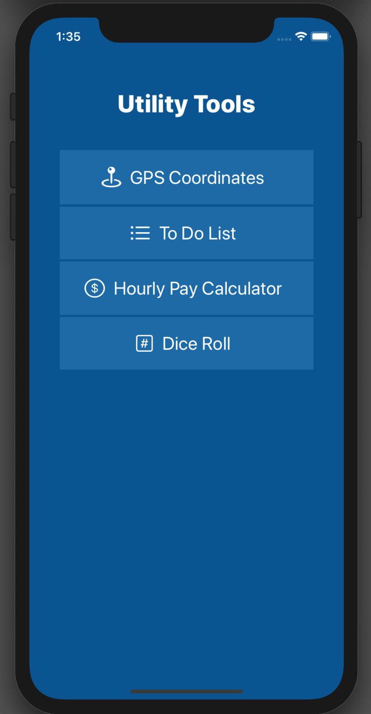
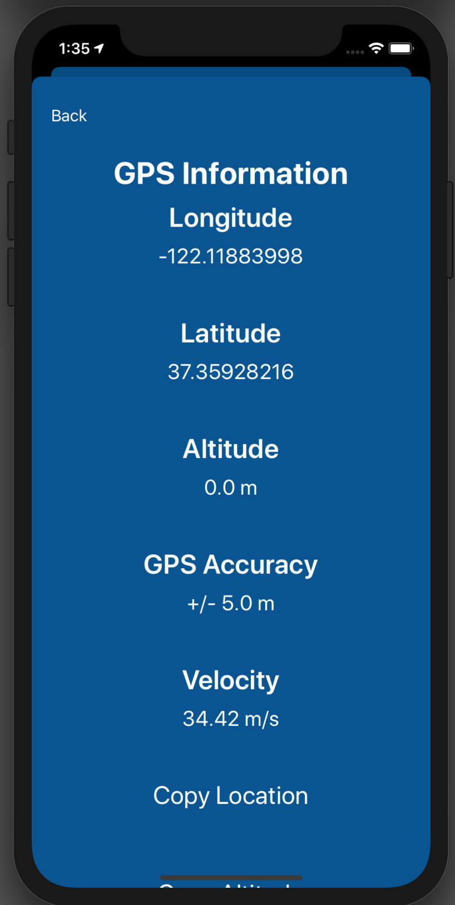
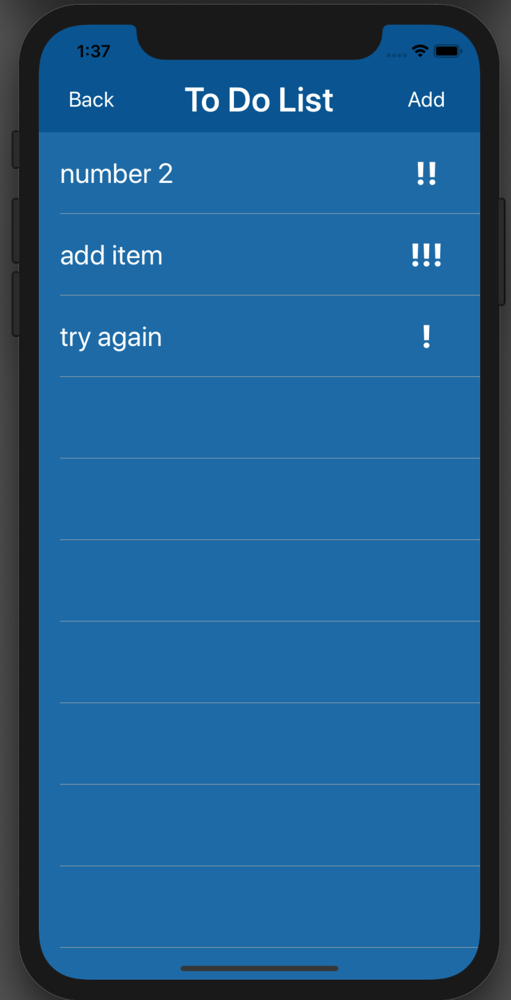
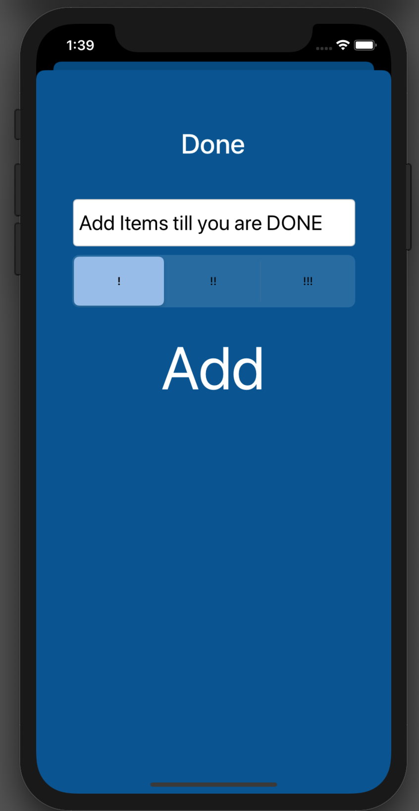
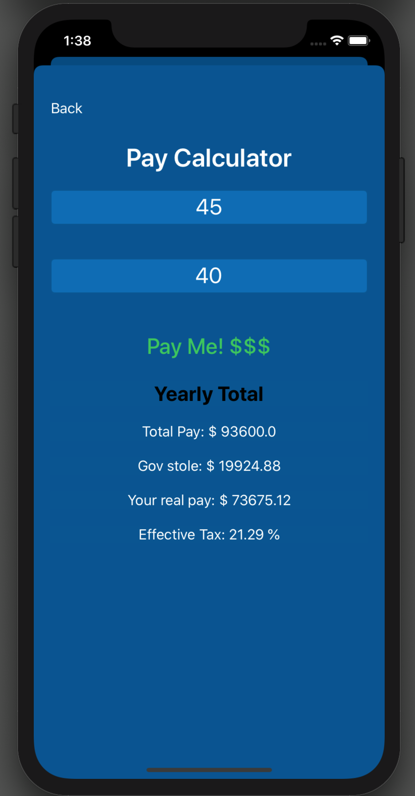
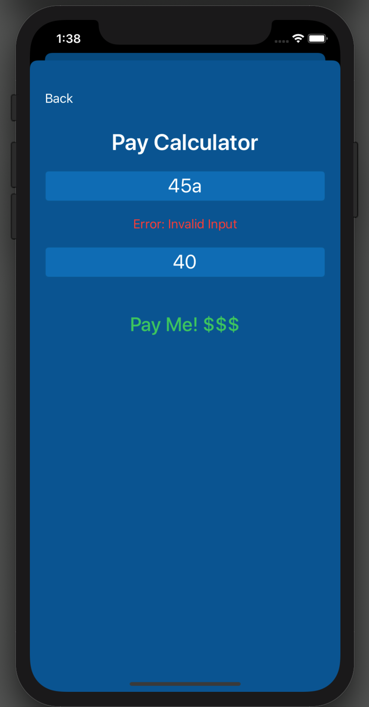
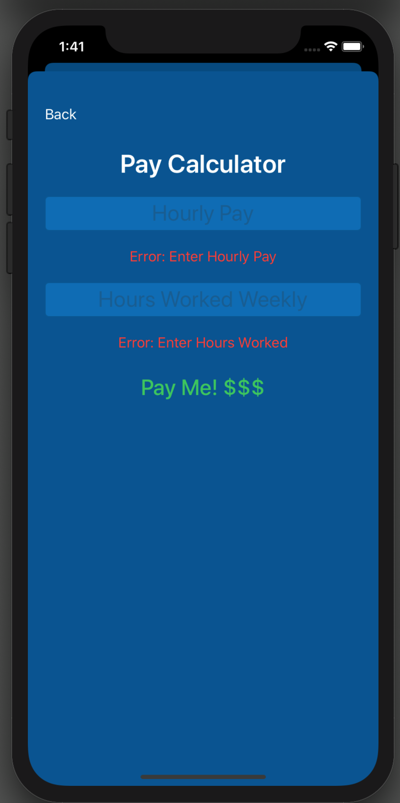

# ToolBox_App
My first completed app. It has four separate features and was a project I used to learn app development in swift.
1. A GPS location display
2. To Do List
3. Hourly Pay Calculator
4. A 3D Dice Roll made with Scenekit in a full physics enviroment.

 

